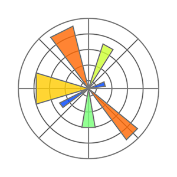

  

 
<h3>Sobre mi</h3>
  

¡Hola!, mi nombre es Bastián López, <b>graduado en análisis de datos y actualmente cursando estudios en Data Science</b> en un instituto profesional. Tengo un fuerte interés en crear visualizaciones impactantes y en extraer información valiosa a partir de datos. Poseo habilidades en Google Sheets, Excel, Python, SQL y Tableau, además de conocimientos en <b>inteligencia de negocios y marketing digital</b>, los cuales he aplicado en diversos proyectos que forman parte de mi portafolio.
  

<h3>Desarrollo profesional</h3>
  

Actualmente me encuentro trabajando en proyectos para mi portafolio y adquiriendo nuevos conocimientos sobre <b>Machine Learning y Plataformas Cloud</b>. Proximamente me gustaría aprender <b>Power Bi y Conocimientos de ingeniería de datos</b> para mejorar mis capacidades.

<h3>Portafolio</h3>
  

En este perfil están todos los proyectos de análisis de mi portafolio, la mayoría están en formato notebook (informe de análisis de datos), puedes ver <a href="https://public.tableau.com/app/profile/basti.n.l.pez/vizzes" target="_blank" rel="noopener noreferrer">aquí</a> los dashboards que he construído en Tableau.
  

<!-- <h3>Dashboards</h3>
  

En este perfil están todos los proyectos de análisis de mi portafolio, la mayoría están en formato notebook (informe de análisis de datos), puedes ver <a href="https://public.tableau.com/app/profile/basti.n.l.pez/vizzes" target="_blank" rel="noopener noreferrer">aquí</a> los dashboards que he construído en Tableau.
  
-->
<h3>Tecnologías dominadas</h3>

              

<!-- <h3>Racha actual de contribuciones</h3>

 
-->
<h3>Contacto</h3>

 
